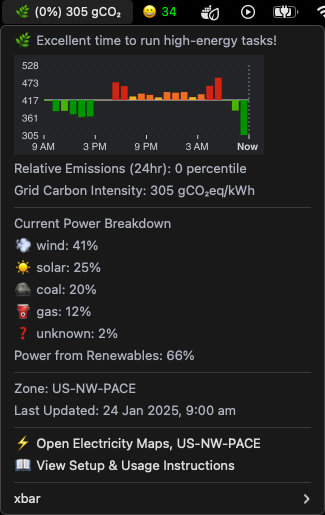
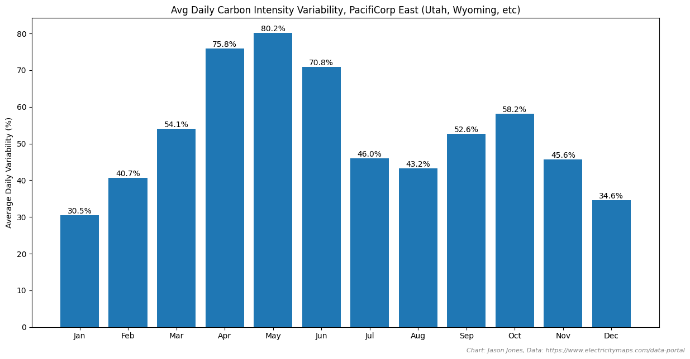
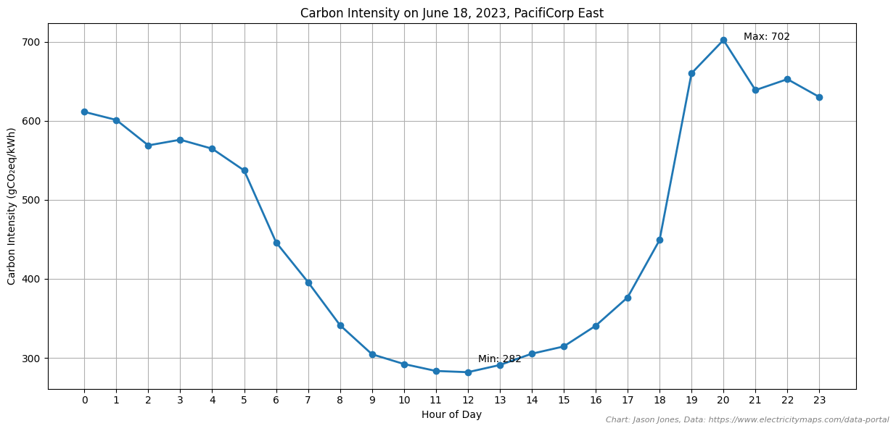

# Carbon Intensity xbar Plugin

What if you could reduce your electricity carbon footprint by 20-50% or more without spending a dime?  This free [xbar plugin](https://xbarapp.com/) shows real-time carbon intensity and cleanliness data for your local grid in your menu bar.  The purpose is to help you make real-time decisions about when to run electricity-intensive tasks (laundry, HVAC, EV charging, etc.) to minimize your carbon footprint. 



In some parts of the country, the grid may be up to [80% dirtier](https://github.com/jasonm-jones/grid-carbon-intensity/blob/main/README.md) than other times in the same day.  Let's look at a couple examples.  The **average** day in May in Pacificorp East (Utah, Idaho, Wyoming, etc) varies 80%.  Individual days can vary even more than that.  On June 18, 2023 at noon the sun was shining and the carbon intensity was only 282 gCO₂eq/kWh.  By 8pm the carbon intensity had spiked to 702 gCO₂eq/kWh.   If you were to charge your EV for 1 hour at 10kWh, you would emit 2,820 gCO₂.  If you were to charge your EV at 8pm, you would emit 7,020 gCO₂.  Your carbon footprint would have been 2.5 times higher if you charged your EV at 8pm instead of noon.  More data andinsights [here](https://github.com/jasonm-jones/grid-carbon-intensity/blob/main/README.md).




## Understanding the Display

The plugin shows several key metrics:
- **Menu Bar**: Shows the current grid cleanliness emoji, percentile, and carbon intensity
- **Graph**: Shows the last 24 hours of carbon intensity relative to the average
  - Red Bars above the center line indicate dirtier than average periods
  - Green Bars below the center line indicate cleaner than average periods
  - Colors indicate relative cleanliness (green = clean, red = dirty)
  - A vertical dashed line marks the current time ("Now")
- **Relative Emissions** (%): How clean the grid is compared to the last 24 hours
- **Carbon Intensity** (gCO₂eq/kWh): The amount of carbon dioxide emitted per kilowatt-hour of electricity used (lower is better)
- **Power Breakdown**: Percentage of power from each source (renewables and fossil fuels)

### Grid Cleanliness Indicators

The emoji shows how clean your grid electricity is right now **relative to the last 24 hours**:

| Emoji | Meaning |
|-------|---------|
| 🌿 | Relatively Clean - Top 20% cleanest kW's of the last 24 hours |
| 🌱 | Cleaner than Average - 60-80th percentile |
| 😑 | Average Conditions - 40-60th percentile |
| 😡 | Dirtier than Average - 20-40th percentile |
| ⛔ | Very Dirty - Bottom 20% |
| ❓ | Data Unavailable |

For example:
- "🌿 (23%) 245 gCO₂eq/kWh" means the grid cleanliness is in the 23rd percentile (top 77% cleanest) relative to the last 24 hours
- "⛔ (85%) 450 gCO₂eq/kWh" means the grid cleanliness is in the 85th percentile (bottom 15% dirtiest) relative to the last 24 hours

This can help you decide when to run energy-intensive tasks for minimum environmental impact.

## Installation

1. Install [xbar](https://xbarapp.com/) (macOS only)
2. Open xbar and click "Browse Plugins"
3. Search for "Carbon Intensity" in the Environment category
   - If not found, you can manually copy the plugin from [carbon-intensity.15m.js](https://github.com/jasonm-jones/carbon-intensity-xbar/blob/main/carbon-intensity.15m.js) to your xbar plugins directory (typically at `~/Library/Application Support/xbar/plugins/`)
4. Click "Install"
5. Install required dependencies using either option:

   **Option 1 - Using Homebrew (recommended)**:
   ```bash
   # Install system dependencies
   brew install pkg-config cairo pango libpng jpeg giflib
   
   # Install npm packages
   npm install canvas
   ```

   **Option 2 - Using MacPorts**:
   ```bash
   # Install system dependencies
   sudo port install pkgconfig cairo pango libpng jpeg giflib
   
   # Install npm packages
   npm install canvas
   ```

6. Configure your API keys and zones (see Configuration below)
7. Refresh xbar

## Configuration

1. Get your API credentials:
   - Get an [Electricity Maps API key](https://api-portal.electricitymaps.com/signup)

2. Find your zone information (see Zones section below)

3. Configure the plugin:
   - Create a new file in the xbar plugins directory called `carbon-intensity.15m.js.vars.json`
     (typically at `~/Library/Application Support/xbar/plugins/carbon-intensity.15m.js.vars.json`)
   - Copy this template and replace with your values:
     ```json
     {
       "ELECTRICITY_MAPS_API_KEY": "your-electricity-maps-api-key-here",
       "ELECTRICITY_MAPS_ZONE": "your-electricity-maps-zone-here"
     }
     ```

Note: The `.vars.json` file contains your API key and should not be shared or committed to version control.

## Zones
Common zones for US regions:

| Region | Electricity Maps |
|--------|-----------------|
| Northern California | US-CAISO_NORTH |
| Southern California | US-CAISO_SOUTH |
| New York | US-NY |
| New England | US-NE |
| Pennsylvania-New Jersey-Maryland | US-PJM |
| Midcontinent | US-MISO |
| Texas | US-TEX |
| Utah-Wyoming-Colorado | US-NW-PACE |

## Finding Your Zone

1. **Electricity Maps Zone**:
   - Visit [Electricity Maps Live Map](https://app.electricitymaps.com/map)
   - Click on your location
   - Your zone ID will appear in the URL (e.g., `US-CAISO_NORTH`)

OR visit [Electricity Maps Zones](https://static.electricitymaps.com/api/docs/index.html#zones)

## Features
- Real-time carbon intensity in gCO₂eq/kWh
- Grid cleanliness percentile
- Visual indicators for grid cleanliness
- Power source breakdown
- Hourly updates

## Data Sources
- [Electricity Maps](https://www.electricitymaps.com/): Carbon intensity and power source breakdown

## License
MIT